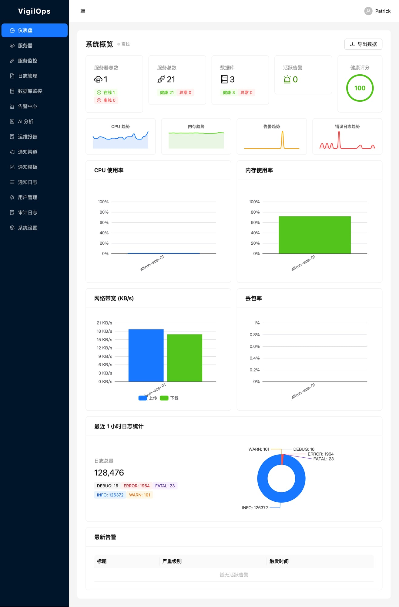
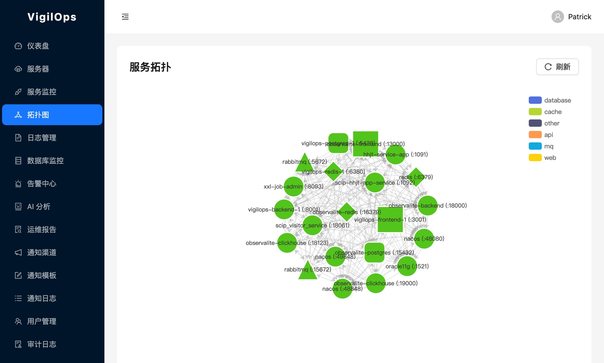

<div align="center">

# 🛡️ VigilOps

**AI-powered infrastructure monitoring that watches, analyzes, and heals your systems — automatically.**

[](https://github.com/LinChuang2008/vigilops)
[](LICENSE)
[](https://hub.docker.com/)
[](CONTRIBUTING.md)

[Demo](https://vigilops.dev) · [Docs](https://docs.vigilops.dev) · [Discord](https://discord.gg/vigilops) · [中文](#-中文简介)

</div>

---

Most monitoring tools tell you something broke. **VigilOps tells you why — and fixes it.**

Built with an AI Agent at its core, VigilOps goes beyond dashboards and alerts. It understands your infrastructure topology, predicts failures before they happen, and autonomously remediates common issues — so your on-call team can finally sleep.



## 🤖 How the AI Agent Works

```
  Alert Triggered        AI Diagnoses          Runbook Executes       Resolved
  ┌──────────┐        ┌──────────────┐        ┌───────────────┐     ┌─────────┐
  │ Disk 95% │───────▶│ Root Cause   │───────▶│ disk_cleanup   │────▶│ Disk 60%│
  │ Alert    │        │ Analysis     │        │ runbook runs   │     │ ✅ Fixed │
  └──────────┘        └──────────────┘        └───────────────┘     └─────────┘
       │                     │                        │
   Monitors              DeepSeek AI            Safety checks +
   detect issue          correlates logs        approval workflow
                         & metrics              before execution
```

**6 Built-in Runbooks** — ready to use out of the box:

| Runbook | What it does |
|---------|-------------|
| 🧹 `disk_cleanup` | Clears temp files, old logs, reclaims disk space |
| 🔄 `service_restart` | Gracefully restarts failed services |
| 💾 `memory_pressure` | Identifies and mitigates memory hogs |
| 📝 `log_rotation` | Rotates and compresses oversized logs |
| 💀 `zombie_killer` | Detects and terminates zombie processes |
| 🔌 `connection_reset` | Resets stuck connections and connection pools |

## ✨ Features

- 🤖 **AI Agent Auto-Remediation** — Autonomous incident response with 6 built-in runbooks, safety checks, and approval workflows
- 🧠 **AI Root Cause Analysis** — DeepSeek-powered log correlation, anomaly detection, and intelligent insights
- 🖥️ **Server Monitoring** — CPU, memory, disk, network with real-time WebSocket metrics
- 🔌 **Service Health Checks** — HTTP, TCP, gRPC endpoint monitoring with latency tracking
- 🗄️ **Database Monitoring** — PostgreSQL, MySQL, Oracle — slow queries, connections, QPS
- 🚨 **Smart Alerting** — Metric, log keyword, and DB threshold rules with noise reduction & cooldown
- 📊 **SLA Management** — Uptime SLOs, error budgets, violation detection
- 🗺️ **Service Topology** — Interactive dependency maps with drag layout, AI-suggested dependencies, health overlay
- 📝 **Operations Reports** — Auto-generated daily/weekly incident summaries
- 🔔 **5 Notification Channels** — DingTalk, Feishu, WeCom, Email, Webhook
- 📋 **Audit Logs** — Full operation audit trail for compliance
- 🎨 **22 Dashboard Pages** — Beautiful, responsive UI built with React + TypeScript



## 🏆 Why VigilOps?

| Feature | VigilOps | Zabbix | Prometheus+Grafana | Datadog |
|---------|----------|--------|-------------------|---------|
| AI Root Cause Analysis | ✅ Built-in | ❌ | ❌ | 💰 Add-on |
| Auto-Remediation | ✅ 6 Runbooks | ❌ | ❌ | 💰 Enterprise |
| Self-Hosted | ✅ | ✅ | ✅ | ❌ |
| Setup Time | ~2 min | Hours | Hours | Minutes |
| Open Source | ✅ Apache 2.0 | ✅ GPL | ✅ Apache | ❌ |
| All-in-One (Monitor+Alert+Fix) | ✅ | Partial | ❌ Need stack | ✅ |

## 👥 Who is this for?

- **DevOps / SRE Teams** — Reduce MTTR with AI-driven diagnostics and auto-remediation
- **SMB IT Teams** — Enterprise-grade monitoring without enterprise complexity or cost
- **MSPs / Managed Service Providers** — Monitor multiple clients with one self-hosted platform

## 🚀 Quick Start

Get VigilOps running in under 2 minutes:

```bash
# Clone the repository
git clone https://github.com/LinChuang2008/vigilops.git
cd vigilops

# Start all services
docker compose up -d

# Open the dashboard
open http://localhost:3000
```

Default credentials: `admin` / `vigilops`

That's it. No complex configuration needed.

## 🏗️ Architecture

```
┌─────────────────────────────────────────────────┐
│                  React Frontend                  │
│              (TypeScript + Vite)                  │
└─────────────────────┬───────────────────────────┘
                      │ REST / WebSocket
┌─────────────────────▼───────────────────────────┐
│               FastAPI Backend                    │
│  ┌──────────┐ ┌──────────┐ ┌──────────────────┐ │
│  │ Monitors │ │ Alerting │ │   AI Agent       │ │
│  │ Engine   │ │ Engine   │ │   (Auto-Heal)    │ │
│  └────┬─────┘ └────┬─────┘ └────────┬─────────┘ │
│       │             │                │           │
│  ┌────▼─────────────▼────────────────▼─────────┐ │
│  │          Core Service Layer                  │ │
│  └──────┬──────────────────┬────────────────────┘ │
└─────────┼──────────────────┼────────────────────┘
          │                  │
  ┌───────▼──────┐   ┌──────▼───────┐
  │ PostgreSQL   │   │    Redis     │
  │ (persistent) │   │   (cache +   │
  │              │   │    pub/sub)  │
  └──────────────┘   └──────────────┘
```

## 🛠️ Tech Stack

| Layer | Technology |
|-------|-----------|
| **Frontend** | React 18, TypeScript, Vite, Ant Design, ECharts |
| **Backend** | Python 3.11+, FastAPI, SQLAlchemy |
| **Database** | PostgreSQL 15+, Redis 7+ |
| **AI** | DeepSeek API, Custom AI Agent with Runbook engine |
| **Infra** | Docker, Docker Compose, Nginx |

## 🤝 Contributing

We love contributions! Whether it's bug reports, feature requests, or pull requests — every bit helps.

Please read our [Contributing Guide](CONTRIBUTING.md) to get started.

```bash
# Set up dev environment
cp .env.example .env
docker compose -f docker-compose.dev.yml up -d
pip install -r requirements-dev.txt
cd frontend && npm install
```

## 📄 License

[Apache 2.0](LICENSE) — use it, fork it, ship it.

---

## 🇨🇳 中文简介

**VigilOps** 是一个 AI 驱动的开源基础设施监控平台。与传统监控工具不同，VigilOps 内置 AI Agent，不仅能发现问题、分析根因，还能**自动修复**常见故障——无需人工介入。

### 核心差异化：AI 自动修复

内置 6 个修复 Runbook：磁盘清理、服务重启、内存压力缓解、日志轮转、僵尸进程清除、连接重置。告警触发 → AI 诊断 → 安全检查 → 自动执行，全流程闭环。

### 为什么选 VigilOps？

- ✅ **AI 根因分析 + 自动修复** — 竞品要么没有，要么收费
- ✅ **2 分钟部署** — `docker compose up -d` 即可运行
- ✅ **全栈监控** — 服务器 / 服务 / 数据库 / 日志 / 拓扑 一站搞定
- ✅ **5 种通知渠道** — 钉钉、飞书、企微、邮件、Webhook
- ✅ **SLA 管理** — 可用性追踪、错误预算、违规检测
- ✅ **开源免费** — Apache 2.0，可私有部署

### 适合谁？

- 🏢 中小企业 IT 团队 — 企业级能力，零门槛上手
- 🔧 DevOps / SRE — AI 辅助降低 MTTR
- 🌐 MSP 运维服务商 — 一套平台管理多个客户

### 快速体验

```bash
git clone https://github.com/LinChuang2008/vigilops.git
cd vigilops && docker compose up -d
```

访问 `http://localhost:3000`，默认账号 `admin` / `vigilops`。

欢迎 Star ⭐ 和贡献代码！

---

<div align="center">

🏢 **Need managed monitoring & AI operations?** We offer professional services.<br>
📧 [support@lchuang.net](mailto:support@lchuang.net)

<sub>Built with ❤️ by the VigilOps community</sub>

</div>
