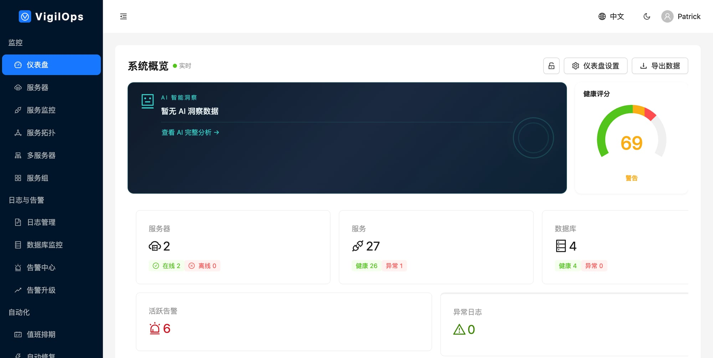
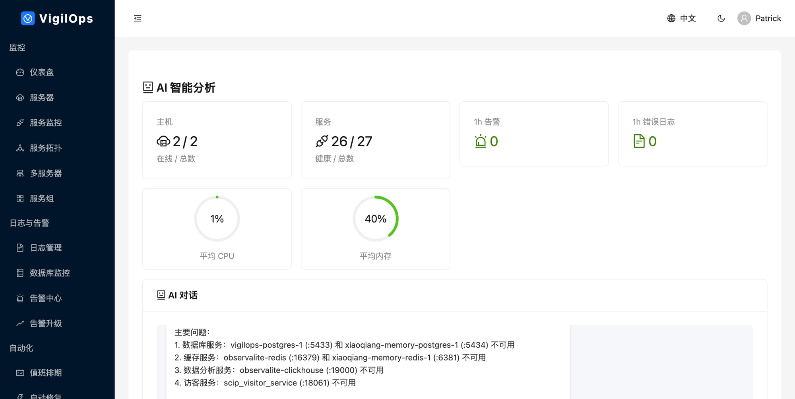
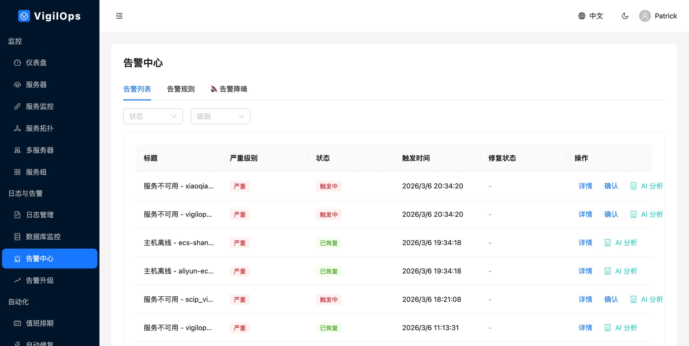
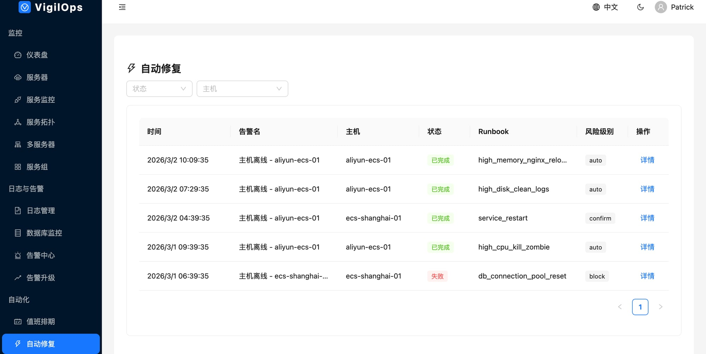

<div align="center">

# 🛡️ VigilOps

**Your team gets 200+ alerts daily. 80% are noise. AI fixes them while you sleep.**

[](https://github.com/LinChuang2008/vigilops)
[](https://demo.lchuangnet.com/login)
[](https://github.com/LinChuang2008/vigilops/releases)
[](https://github.com/LinChuang2008/vigilops)

[🎯 **Live Demo**](https://demo.lchuangnet.com/login) · [📚 Docs](#-documentation) · [🔧 Install](#-5-minute-quickstart) · [中文](#-中文)

</div>

---

## 🔥 **5-Minute QuickStart**

### 🌐 **Try Online First** (No Install)

> 🎯 **Official Demo**: [**demo.lchuangnet.com**](https://demo.lchuangnet.com/login)  
> 👤 **Login**: `demo@vigilops.io` / `demo123` _(read-only)_  
> ⚡ **See it in action**: AI alert analysis, auto-remediation, MCP integration

### 🐳 **Self-Host in 5 Minutes**

```bash
# 1. Clone & Configure
git clone https://github.com/LinChuang2008/vigilops.git && cd vigilops
cp .env.example .env   # ⚠️ Add your DeepSeek API key here

# 2. Start (first run takes 15-30min for build)
docker compose up -d

# 3. Ready!
echo "✅ Open: http://localhost:3001"
```

**First account becomes admin automatically.** No complex setup needed.

---

## 💡 **What Makes VigilOps Different**

You've tried **Grafana + Prometheus**. You know **Zabbix** and **Datadog**. They all tell you *something broke*. None of them **fix it for you**.

VigilOps is the **first open-source AI platform** that doesn't just monitor — it **heals**:

1. **🤖 AI Analyzes** — DeepSeek reads logs, metrics, topology to find the real cause
2. **⚡ AI Decides** — Picks the right Runbook from 6 built-in auto-remediation scripts  
3. **🔧 AI Fixes** — Executes the fix with safety checks and approval workflows
4. **🧠 AI Learns** — Same problems get resolved faster next time

**🏆 Global First**: VigilOps is the **world's first open-source monitoring platform with MCP (Model Context Protocol) integration** — your AI coding assistant can query live production data directly.

---

## 🥊 **Honest Feature Comparison**

| **Feature** | **VigilOps** | **Nightingale (夜莺)** | **Prometheus+Grafana** | **Datadog** | **Zabbix** |
|---|:---:|:---:|:---:|:---:|:---:|
| **🤖 AI Root Cause Analysis** | ✅ Built-in | ❌ | ❌ | 💰 Enterprise Only | ❌ |
| **⚡ Auto-Remediation (Runbooks)** | ✅ 6 Ready | ❌ | ❌ | 💰 Enterprise Only | ❌ |
| **🚀 MCP Integration (AI Agent)** | ✅ **Global First** | ❌ | ❌ | 🟡 Early Access | ❌ |
| **📊 Self-Hosted** | ✅ Docker | ✅ K8s/Docker | ✅ Complex | ❌ SaaS Only | ✅ |
| **💰 Cost** | **Free Forever** | Free/Enterprise | Free | $$$ | Free/Enterprise |
| **⏱️ Setup Time** | **5 minutes** | 30 minutes | 2+ hours | 5 minutes | 1+ hour |
| **👥 Community** | 🔴 New (4⭐) | ⭐ 8k+ stars | ⭐⭐⭐ Massive | N/A | ⭐⭐ Large |
| **🏢 Production Scale** | 🟡 <50 hosts | ✅ 1000+ | ✅ 10000+ | ✅ Unlimited | ✅ 10000+ |
| **🔧 Maturity** | 🔴 Early Stage | ✅ Battle-tested | ✅ Industry Standard | ✅ Industry Leader | ✅ 20+ Years |

**🎯 Sweet Spot**: Small-to-medium teams who want AI-powered ops automation without enterprise licensing costs.

**🚨 Be Honest**: We're early stage. For mission-critical systems at scale, stick with proven solutions. For teams ready to experiment with AI ops, we're your best bet.

---

## 🎬 **See It Work**

```
  Alert Fires           AI Diagnosis           Auto-Fix               Problem Solved
  ┌──────────┐       ┌────────────────┐      ┌──────────────────┐     ┌──────────────┐
  │ Disk 95% │──────▶│ "Log rotation   │─────▶│ log_rotation     │────▶│ Disk 60%     │
  │ on prod  │       │  needed on      │      │ runbook starts   │     │ ✅ Resolved  │
  │ server   │       │  /var/log"      │      │ safely"          │     │ in 2 minutes │
  └──────────┘       └────────────────┘      └──────────────────┘     └──────────────┘
       │                      │                        │
   Monitoring             DeepSeek AI             Automated Runbook
   detects issue          analyzes cause          + safety approval
```

**⚡ 6 Built-in Runbooks** — production-ready:

| Runbook | Fixes |
|---------|-------|
| 🧹 `disk_cleanup` | Clears temp files, old logs, reclaims disk space |
| 🔄 `service_restart` | Gracefully restarts failed services |
| 💾 `memory_pressure` | Kills memory-hogging processes safely |
| 📝 `log_rotation` | Rotates and compresses oversized logs |
| 💀 `zombie_killer` | Terminates zombie processes |
| 🔌 `connection_reset` | Resets stuck network connections |

---

## 🖼️ **Screenshots**

<div align="center">

**🎛️ Dashboard — Real-time metrics across all hosts**


**🧠 AI Alert Analysis — Root cause + recommended action**


**📋 Alert List — AI triage + auto-remediation status**


**🔧 Auto-Remediation — Runbook execution with audit trail**


</div>

---

## The Problem We Solve

Every DevOps team faces this:

- ⚡ **Alert Fatigue**: Prometheus sends 200+ alerts daily, 80% are false positives
- 🕐 **Slow Response**: On-call engineer woken at 3 AM for issues a script could fix  
- 💸 **Expensive Tools**: Enterprise monitoring costs $100K+/year but still needs human intervention
- 🔍 **No Context**: "Disk full" alert with zero clue about root cause or fix

**The monitoring industry's dirty secret**: Most tools excel at *detecting* problems but fail at *solving* them.

VigilOps changes this. We don't add to your alert noise — we **reduce** it.

> ⚠️ **Honest Disclaimer**: VigilOps is early-stage open source. It works in production but isn't battle-tested at enterprise scale. We're seeking early adopters to shape the product. Need guaranteed uptime today? Choose Datadog or PagerDuty.

---

## 🚀 **Full Installation Guide**

### **Prerequisites**

- Docker 20+ & Docker Compose v2+
- 4 CPU cores / 8 GB RAM (for initial build; 2 GB for runtime)  
- Ports 3001 (frontend) & 8001 (backend) available

---

### **1. Production Deployment**

```bash
# 1. Clone to server
git clone https://github.com/LinChuang2008/vigilops.git /opt/vigilops
cd /opt/vigilops

# 2. Configure secrets (REQUIRED)
cp .env.example .env
# ⚠️ MUST EDIT these before production:
#   POSTGRES_PASSWORD  — Strong password
#   JWT_SECRET_KEY     — Random string (generate: openssl rand -hex 32)
#   AI_API_KEY         — Your DeepSeek API key
#   AI_AUTO_SCAN=true  — Enable automatic alert analysis

# 3. Deploy
docker compose up -d

# 4. Verify
curl http://localhost:8001/health
# ✅ {"status": "healthy"}

# 5. Access
# http://<server-ip>:3001
# First registered user becomes admin
```

---

### **2. Installing Agents (Monitored Servers)**

Each server needs the lightweight VigilOps Agent to collect metrics and logs.

**One-liner install**:

```bash
# Get agent token from UI: Server Management → Add Server → Copy Token
curl -fsSL http://your-vigilops-server:8001/agent/install.sh | \
  VIGILOPS_SERVER=http://your-vigilops-server:8001 \
  AGENT_TOKEN=your-token-from-ui \
  bash
```

**Requirements**: Linux (Ubuntu/Debian/CentOS/RHEL), Python ≥3.9, root access.

---

### **3. Environment Variables**

| Variable | Required | Description | Example |
|----------|----------|-------------|---------|
| `POSTGRES_PASSWORD` | ✅ | Database password | Strong random password |
| `JWT_SECRET_KEY` | ✅ | JWT signing key | `openssl rand -hex 32` |
| `AI_API_KEY` | ✅ | DeepSeek API key | `sk-abc123...` |
| `AI_AUTO_SCAN` | ⚡ | Auto-analyze alerts | `true` |
| `AGENT_ENABLED` | ⚡ | Enable auto-remediation | `false` (start safe) |
| `BACKEND_PORT` | 🔧 | Backend host port | `8001` |
| `FRONTEND_PORT` | 🔧 | Frontend host port | `3001` |

---

## 🤖 **MCP Integration — Global Open Source First!**

VigilOps is the **world's first open-source monitoring platform** with built-in **MCP (Model Context Protocol)** support. Your AI coding assistant (Claude Code, Cursor) can query live production data directly from chat.

### **Enable MCP Server**

Add to `backend/.env`:

```env
VIGILOPS_MCP_ENABLED=true
VIGILOPS_MCP_HOST=0.0.0.0    # Allow external access
VIGILOPS_MCP_PORT=8003
VIGILOPS_MCP_TOKEN=your-secret-token
```

Restart backend: `docker compose restart backend`

### **Connect Claude Desktop**

Edit `~/.claude/claude_desktop_config.json`:

```json
{
  "mcpServers": {
    "vigilops": {
      "type": "http",
      "url": "http://your-server:8003/mcp",
      "headers": {
        "Authorization": "Bearer your-secret-token"
      }
    }
  }
}
```

### **🛠️ Available MCP Tools (5 total)**

| Tool | What It Does |
|------|--------------|
| `get_servers_health` | Get real-time health status of all monitored servers |
| `get_alerts` | Query alerts by status, severity, host, time range |
| `search_logs` | Search production logs by keyword and timeframe |
| `analyze_incident` | AI-powered root cause analysis with fix recommendations |
| `get_topology` | Retrieve service dependency map data |

### **Usage Examples**

Once connected, ask your AI assistant:

```
"Show me all critical alerts on prod-server-01"
"Analyze last night's CPU spike incident"  
"Search for OOM errors in the past 2 hours"
"What's the health status of all servers?"
"Run incident analysis for the database slowness"
```

**🏆 This is a global open-source first!** No other monitoring platform offers MCP integration out of the box.

---

## 🔧 **What's Included**

- **🤖 AI Root Cause Analysis** — DeepSeek analyzes logs, metrics, topology to explain *why*
- **⚡ Auto-Remediation Engine** — 6 built-in Runbooks with safety checks; AI picks and executes  
- **🔌 MCP Server** — 5 tools for AI Agent integration (first in open source!)
- **📊 Full-Stack Monitoring** — Servers, services (HTTP/TCP/gRPC), databases (PostgreSQL/MySQL)
- **🔔 Smart Alerting** — Metric/log/database rules with noise reduction and cooldown
- **📈 Alert Escalation** — Auto-escalation with on-call calendar integration
- **📝 Multi-Backend Logs** — PostgreSQL, ClickHouse, or Loki storage
- **🗺️ Service Topology** — Interactive dependency maps with health overlay  
- **📢 5 Notification Channels** — DingTalk, Feishu, WeCom, Email, Webhook
- **📐 SLA Tracking** — Uptime SLOs, error budgets, violation alerts
- **🌐 i18n Support** — Full Chinese & English UI (~300 translation keys)
- **📱 24 Dashboard Pages** — React 19 + TypeScript + Ant Design 6

---

## 📚 **Documentation**

| Guide | Description |
|-------|-------------|
| [🚀 Getting Started](docs/getting-started.md) | First-time setup guide |
| [⚙️ Installation](docs/installation.md) | Docker/manual deploy + env config |
| [📖 User Guide](docs/user-guide.md) | Complete feature walkthrough |
| [🔌 API Reference](docs/api-reference.md) | REST API documentation |
| [🏗️ Architecture](docs/architecture.md) | System design + data flow |
| [🤝 Contributing](docs/contributing.md) | Dev environment + standards |
| [📋 Changelog](docs/changelog.md) | Version history |

---

## 🔧 **Tech Stack**

| Layer | Technology |
|-------|------------|
| **Frontend** | React 19, TypeScript, Vite, Ant Design 6, ECharts 6 |
| **Backend** | Python 3.9+, FastAPI, SQLAlchemy, AsyncIO |
| **Database** | PostgreSQL 15+, Redis 7+ |
| **Log Storage** | PostgreSQL / ClickHouse / Loki |
| **AI** | DeepSeek API (configurable LLM endpoint) |
| **Deployment** | Docker Compose |

---

## 🏗️ **Architecture**

```
┌──────────────────────────────────────────────────┐
│              React 19 Frontend                    │
│       TypeScript + Vite + Ant Design 6          │
└───────────────────┬──────────────────────────────┘
                    │ REST / WebSocket
┌───────────────────▼──────────────────────────────┐
│              FastAPI Backend                      │
│  ┌──────────┐ ┌───────────┐ ┌──────────────────┐ │
│  │ 29 API   │ │ Alerting  │ │ AI Agent         │ │
│  │ Routers  │ │ Engine +  │ │ + Runbooks +     │ │
│  │          │ │ Escalation│ │ MCP Server       │ │
│  └────┬─────┘ └────┬──────┘ └────────┬─────────┘ │
│       └─────────────┼────────────────┘           │
│                Core Services (13)                 │
└──────┬──────────────┼───────────────────────────┘
       │              │
┌──────▼──────┐ ┌─────▼──────┐
│ PostgreSQL  │ │   Redis    │
│ (data +     │ │ (cache +   │
│  logs)      │ │  pub/sub)  │
└─────────────┘ └────────────┘
```

---

## 🤝 **Contributing**

We need contributors who understand alert fatigue firsthand.

```bash
# Quick dev setup
cp .env.example .env
docker compose -f docker-compose.dev.yml up -d
pip install -r requirements-dev.txt
cd frontend && npm install
```

See [CONTRIBUTING.md](CONTRIBUTING.md) for guidelines.

---

## 📄 **License**

[Apache 2.0](LICENSE) — Use it, fork it, ship it commercially.

---

## 🇨🇳 **中文版**

### **5分钟快速体验 VigilOps**

#### **🌐 在线演示（免安装）**

> 🎯 **官方演示**: [**demo.lchuangnet.com**](https://demo.lchuangnet.com/login)  
> 👤 **登录账号**: `demo@vigilops.io` / `demo123` _(只读模式)_  
> ⚡ **立即查看**: AI告警分析、自动修复、MCP集成

#### **🐳 本地部署（5分钟）**

```bash
# 1. 克隆并配置
git clone https://github.com/LinChuang2008/vigilops.git && cd vigilops
cp .env.example .env   # ⚠️ 在这里填入你的 DeepSeek API Key

# 2. 启动（首次运行需要15-30分钟构建）
docker compose up -d

# 3. 完成！
echo "✅ 打开浏览器访问: http://localhost:3001"
```

**第一个注册的账号自动成为管理员。** 无需复杂配置。

---

### **💡 VigilOps 的独特之处**

你试过 **Grafana + Prometheus**，知道 **夜莺** 和 **Datadog**。它们都能告诉你 *哪里出了问题*，但没有一个能 **帮你修好**。

VigilOps 是 **全球首个开源AI运维平台**，不只是监控——还能 **自愈**：

1. **🤖 AI分析** — DeepSeek 读取日志、指标、拓扑找到真正原因
2. **⚡ AI决策** — 从6个内置自动修复脚本中选择正确的Runbook
3. **🔧 AI修复** — 带安全检查和审批流程的自动执行
4. **🧠 AI学习** — 同类问题下次解决得更快

**🏆 全球首创**: VigilOps 是 **全世界第一个开源监控平台，内置 MCP（模型上下文协议）集成** — 你的AI编程助手可以直接查询生产环境数据。

---

### **🥊 功能对比（实话实说）**

| **功能** | **VigilOps** | **夜莺** | **Prometheus+Grafana** | **Datadog** | **Zabbix** |
|---|:---:|:---:|:---:|:---:|:---:|
| **🤖 AI根因分析** | ✅ 内置 | ❌ | ❌ | 💰 企业版 | ❌ |
| **⚡ 自动修复** | ✅ 6个现成 | ❌ | ❌ | 💰 企业版 | ❌ |
| **🚀 MCP集成** | ✅ **全球首创** | ❌ | ❌ | 🟡 早期版本 | ❌ |
| **📊 私有部署** | ✅ Docker | ✅ K8s/Docker | ✅ 复杂 | ❌ 仅SaaS | ✅ |
| **💰 成本** | **永久免费** | 免费/企业版 | 免费 | $$$ | 免费/企业版 |
| **⏱️ 部署时间** | **5分钟** | 30分钟 | 2小时+ | 5分钟 | 1小时+ |
| **👥 社区** | 🔴 新项目(4⭐) | ⭐ 8k+星标 | ⭐⭐⭐ 庞大 | N/A | ⭐⭐ 大 |
| **🏢 生产规模** | 🟡 <50台主机 | ✅ 1000+ | ✅ 10000+ | ✅ 无限制 | ✅ 10000+ |
| **🔧 成熟度** | 🔴 早期阶段 | ✅ 久经考验 | ✅ 行业标准 | ✅ 行业领导者 | ✅ 20+年 |

**🎯 适合场景**: 中小团队想要AI驱动的运维自动化，不想付企业版授权费。

**🚨 诚实声明**: 我们还很早期。对于大规模关键系统，选择成熟方案。对于准备尝试AI运维的团队，我们是最佳选择。

---

### **🎬 工作原理**

```
  告警触发          AI诊断            自动修复              问题解决
  ┌──────────┐    ┌─────────────┐    ┌──────────────────┐   ┌──────────────┐
  │ 生产服务器│───▶│ "需要清理    │───▶│ log_rotation     │──▶│ 磁盘从95%    │
  │ 磁盘95%  │    │ /var/log    │    │ runbook安全启动   │   │ 降到60% ✅   │
  │ 告警     │    │ 日志文件"    │    │ 执行中"           │   │ 2分钟解决    │
  └──────────┘    └─────────────┘    └──────────────────┘   └──────────────┘
       │                │                      │
   监控系统          DeepSeek AI          自动化Runbook
   检测问题          分析原因              +安全审批
```

**⚡ 6个内置Runbook** — 生产可用：

| Runbook | 解决什么 |
|---------|----------|
| 🧹 `disk_cleanup` | 清理临时文件、旧日志，回收磁盘空间 |
| 🔄 `service_restart` | 优雅重启失败的服务 |
| 💾 `memory_pressure` | 安全杀死内存占用过高的进程 |
| 📝 `log_rotation` | 轮转和压缩过大的日志文件 |
| 💀 `zombie_killer` | 终止僵尸进程 |
| 🔌 `connection_reset` | 重置卡住的网络连接 |

---

### **我们解决的问题**

每个运维团队都面临这些：

- ⚡ **告警疲劳**: Prometheus每天发200+条告警，80%是误报
- 🕐 **响应缓慢**: 凌晨3点叫醒值班工程师处理脚本就能解决的问题
- 💸 **工具昂贵**: 企业监控工具年费10万+，但还是需要人工处理
- 🔍 **缺乏上下文**: "磁盘满了"告警，但不知道根因和解决方案

**监控行业的肮脏秘密**: 大多数工具擅长 *发现* 问题但不擅长 *解决* 问题。

VigilOps改变这一点。我们不是增加告警噪音——而是 **减少** 它。

> ⚠️ **诚实声明**: VigilOps是早期开源项目。它能在生产环境工作，但还未在企业规模经过充分考验。我们在寻找早期用户来塑造产品。如果你今天就需要保证的正常运行时间，选择Datadog或PagerDuty。

---

### **🚀 完整安装指南**

#### **系统要求**

- Docker 20+ & Docker Compose v2+
- 4核CPU / 8GB内存（初始构建；运行期2GB）
- 端口 3001（前端）& 8001（后端）可用

#### **生产环境部署**

```bash
# 1. 克隆到服务器
git clone https://github.com/LinChuang2008/vigilops.git /opt/vigilops
cd /opt/vigilops

# 2. 配置密钥（必须）
cp .env.example .env
# ⚠️ 生产前必须修改：
#   POSTGRES_PASSWORD  — 强密码
#   JWT_SECRET_KEY     — 随机字符串（生成: openssl rand -hex 32）
#   AI_API_KEY         — 你的DeepSeek API Key
#   AI_AUTO_SCAN=true  — 启用自动告警分析

# 3. 部署
docker compose up -d

# 4. 验证
curl http://localhost:8001/health
# ✅ {"status": "healthy"}

# 5. 访问
# http://<服务器IP>:3001
# 第一个注册用户自动成为管理员
```

---

### **🤖 MCP集成 — 全球开源首创！**

VigilOps是 **世界第一个开源监控平台**，内置 **MCP（模型上下文协议）** 支持。你的AI编程助手（Claude Code, Cursor）可以直接从聊天界面查询实时生产数据。

#### **启用MCP服务器**

在 `backend/.env` 中添加：

```env
VIGILOPS_MCP_ENABLED=true
VIGILOPS_MCP_HOST=0.0.0.0    # 允许外部访问
VIGILOPS_MCP_PORT=8003
VIGILOPS_MCP_TOKEN=your-secret-token
```

重启后端：`docker compose restart backend`

#### **连接Claude Desktop**

编辑 `~/.claude/claude_desktop_config.json`：

```json
{
  "mcpServers": {
    "vigilops": {
      "type": "http", 
      "url": "http://你的服务器:8003/mcp",
      "headers": {
        "Authorization": "Bearer your-secret-token"
      }
    }
  }
}
```

#### **🛠️ 可用MCP工具（共5个）**

| 工具 | 功能 |
|------|------|
| `get_servers_health` | 获取所有监控服务器的实时健康状态 |
| `get_alerts` | 按状态、严重性、主机、时间范围查询告警 |
| `search_logs` | 按关键词和时间范围搜索生产日志 |
| `analyze_incident` | AI驱动的根因分析和修复建议 |
| `get_topology` | 检索服务依赖图数据 |

#### **使用示例**

连接后，向你的AI助手询问：

```
"显示prod-server-01上的所有严重告警"
"分析昨晚CPU飙升事件"
"搜索过去2小时的OOM错误"  
"所有服务器的健康状态如何？"
"对数据库缓慢问题运行事件分析"
```

**🏆 这是全球开源首创！** 没有其他监控平台开箱即用地提供MCP集成。

---

### **联系我们**

- [GitHub Discussions](https://github.com/LinChuang2008/vigilops/discussions) — 提问、建议、交流
- [报告Bug](https://github.com/LinChuang2008/vigilops/issues/new)
- 📧 [lchuangnet@lchuangnet.com](mailto:lchuangnet@lchuangnet.com)

---

<div align="center">

<sub>Built with ❤️ by LinChuang · Apache 2.0</sub>

[](LICENSE)
[](CONTRIBUTING.md)

</div>