# VigilOps 架构设计文档

> 开源智能运维监控平台 — AI 驱动的监控、告警、分析与自动修复

---

## 目录

- [1. 技术栈](#1-技术栈)
- [2. 系统架构](#2-系统架构)
- [3. 数据流](#3-数据流)
- [4. 目录结构](#4-目录结构)
- [5. 数据模型](#5-数据模型)
- [6. AI 引擎](#6-ai-引擎)
- [7. 自动修复系统](#7-自动修复系统)
- [8. 部署架构](#8-部署架构)

---

## 1. 技术栈

| 层级 | 技术选型 |
|------|----------|
| **后端** | FastAPI + SQLAlchemy + PostgreSQL + Redis + Python 3.11+ |
| **前端** | React 18 + TypeScript + Vite + Ant Design + ECharts |
| **部署** | Docker Compose（4 容器：backend + frontend + postgres + redis） |
| **AI** | DeepSeek API（OpenAI 兼容接口） |
| **Agent** | Python agent 进程，systemd 管理，HTTP 上报 |

---

## 2. 系统架构


---

## 3. 数据流


### Agent 采集内容

| 采集器 | 数据类型 |
|--------|----------|
| `collector` | CPU、内存、磁盘、网络等系统指标 |
| `checker` | 服务端口存活检测 |
| `log_collector` | 系统/应用日志 |
| `db_collector` | 数据库指标（PostgreSQL / MySQL / Oracle） |
| `discovery` | 服务自动发现 |

---

## 4. 目录结构

```
vigilops/
├── backend/
│   └── app/
│       ├── routers/            # 24 个路由模块
│       │   ├── auth.py              # 用户认证（注册/登录/JWT）
│       │   ├── users.py             # 用户管理 CRUD + RBAC
│       │   ├── hosts.py             # 主机管理
│       │   ├── servers.py           # 服务器管理
│       │   ├── server_groups.py     # 服务器分组
│       │   ├── services.py          # 服务监控
│       │   ├── topology.py          # 服务拓扑图
│       │   ├── dashboard.py         # 仪表盘数据
│       │   ├── dashboard_ws.py      # 仪表盘 WebSocket
│       │   ├── alerts.py            # 告警管理
│       │   ├── alert_rules.py       # 告警规则
│       │   ├── logs.py              # 日志管理
│       │   ├── databases.py         # 数据库监控
│       │   ├── ai_analysis.py       # AI 智能分析
│       │   ├── notifications.py     # 通知管理（5 渠道）
│       │   ├── notification_templates.py  # 通知模板
│       │   ├── remediation.py       # 自动修复
│       │   ├── reports.py           # 运维报告
│       │   ├── sla.py               # SLA 管理
│       │   ├── settings.py          # 系统设置
│       │   ├── audit_logs.py        # 审计日志
│       │   ├── agent.py             # Agent 数据上报
│       │   └── agent_tokens.py      # Agent Token 管理
│       ├── services/           # 7 个核心服务
│       │   ├── ai_engine.py         # AI 引擎（DeepSeek 集成）
│       │   ├── anomaly_scanner.py   # 异常自动扫描
│       │   ├── notifier.py          # 通知发送 + 降噪
│       │   ├── report_generator.py  # 报告自动生成
│       │   ├── memory_client.py     # 运维记忆客户端
│       │   ├── alert_seed.py        # 告警种子数据
│       │   └── audit.py             # 审计服务
│       ├── models/             # 20+ 数据模型
│       ├── schemas/            # 请求/响应 Pydantic 模型
│       ├── remediation/        # 自动修复系统
│       │   ├── agent.py             # 修复 Agent 主控
│       │   ├── ai_client.py         # AI 诊断客户端
│       │   ├── command_executor.py  # 远程命令执行
│       │   ├── listener.py          # 告警监听触发
│       │   ├── runbook_registry.py  # Runbook 注册中心
│       │   ├── safety.py            # 安全检查（审批流）
│       │   └── runbooks/            # 6 个内置 Runbook
│       │       ├── disk_cleanup.py
│       │       ├── memory_pressure.py
│       │       ├── service_restart.py
│       │       ├── log_rotation.py
│       │       ├── zombie_killer.py
│       │       └── connection_reset.py
│       └── core/               # 核心基础设施
│           ├── config.py            # 配置管理
│           ├── database.py          # 数据库连接
│           └── auth.py              # 认证中间件
├── frontend/
│   └── src/
│       └── pages/              # 22 个页面
│           ├── Dashboard.tsx        # 仪表盘（WebSocket + 健康评分）
│           ├── HostList.tsx         # 服务器列表
│           ├── HostDetail.tsx       # 服务器详情
│           ├── ServiceList.tsx      # 服务列表
│           ├── ServiceDetail.tsx    # 服务详情
│           ├── Topology.tsx         # 服务拓扑图
│           ├── Logs.tsx             # 日志搜索 + 实时流
│           ├── Databases.tsx        # 数据库监控
│           ├── DatabaseDetail.tsx   # 数据库详情
│           ├── AlertList.tsx        # 告警中心
│           ├── AIAnalysis.tsx       # AI 分析界面
│           ├── Remediation.tsx      # 自动修复管理
│           ├── RemediationDetail.tsx # 修复详情
│           ├── Reports.tsx          # 运维报告
│           ├── SLA.tsx              # SLA 管理
│           ├── NotificationChannels.tsx  # 通知渠道配置
│           ├── NotificationLogs.tsx      # 通知日志
│           ├── NotificationTemplates.tsx # 通知模板
│           ├── AuditLogs.tsx        # 审计日志
│           ├── Users.tsx            # 用户管理
│           ├── Settings.tsx         # 系统设置
│           └── Login.tsx            # 登录页
└── agent/
    └── vigilops_agent/         # Agent 采集进程
        ├── collector.py             # 系统指标采集
        ├── checker.py               # 服务存活检测
        ├── log_collector.py         # 日志采集
        ├── db_collector.py          # 数据库指标采集
        ├── discovery.py             # 服务自动发现
        ├── reporter.py              # 数据上报
        ├── cli.py                   # 命令行入口
        └── config.py                # Agent 配置
```

---

## 5. 数据模型

```mermaid
erDiagram
    user {
        int id PK
        string username
        string email
        string role
    }

    host {
        int id PK
        string hostname
        string ip
        string status
    }

    host_metric {
        int id PK
        int host_id FK
        float cpu
        float memory
        float disk
        datetime timestamp
    }

    server {
        int id PK
        string name
        string address
    }

    service {
        int id PK
        string name
        string type
        string status
    }

    service_group {
        int id PK
        string name
    }

    service_dependency {
        int id PK
        int source_id FK
        int target_id FK
    }

    server_service {
        int id PK
        int server_id FK
        int service_id FK
    }

    topology_layout {
        int id PK
        int service_id FK
        float x
        float y
    }

    alert {
        int id PK
        int host_id FK
        string severity
        string status
        string message
    }

    ai_insight {
        int id PK
        int alert_id FK
        string analysis
        string recommendation
    }

    remediation_log {
        int id PK
        int alert_id FK
        string action
        string status
        string result
    }

    log_entry {
        int id PK
        int host_id FK
        string level
        string message
        datetime timestamp
    }

    db_metric {
        int id PK
        int host_id FK
        string db_type
        float connections
        float qps
    }

    notification {
        int id PK
        int alert_id FK
        string channel
        string status
    }

    notification_template {
        int id PK
        string name
        string template
    }

    report {
        int id PK
        string type
        string period
    }

    sla {
        int id PK
        int service_id FK
        float target
        float actual
    }

    setting {
        int id PK
        string key
        string value
    }

    agent_token {
        int id PK
        string token
        string description
    }

    audit_log {
        int id PK
        int user_id FK
        string action
        string resource
    }

    nginx_upstream {
        int id PK
        string name
        string servers
    }

    host ||--o{ host_metric : "产生"
    host ||--o{ alert : "触发"
    host ||--o{ log_entry : "记录"
    host ||--o{ db_metric : "采集"
    alert ||--o| ai_insight : "分析"
    alert ||--o{ remediation_log : "修复"
    alert ||--o{ notification : "通知"
    service ||--o{ service_dependency : "依赖"
    service ||--o| topology_layout : "布局"
    service ||--o| sla : "关联"
    server ||--o{ server_service : "部署"
    service ||--o{ server_service : "运行于"
    user ||--o{ audit_log : "操作"
```



---

## 6. AI 引擎

### 工作流程


### 三种分析模式

| 模式 | Prompt | 用途 |
|------|--------|------|
| **日志分析** | `SYSTEM_PROMPT` | 自动分析日志中的异常模式 |
| **运维问答** | `CHAT_SYSTEM_PROMPT` | 交互式运维问题解答 |
| **根因分析** | `ROOT_CAUSE_SYSTEM_PROMPT` | 告警根因定位与修复建议 |

### 记忆系统集成

通过 `memory_client` 调用 xiaoqiang-memory API，实现：
- **经验召回**：根据当前问题检索历史相似案例
- **经验沉淀**：将分析结果和修复方案存入记忆库
- **知识积累**：随着运维事件积累，AI 分析越来越精准

---

## 7. 自动修复系统


### 内置 Runbook

| Runbook | 触发场景 | 修复动作 |
|---------|----------|----------|
| `disk_cleanup` | 磁盘使用率过高 | 清理临时文件、日志轮转 |
| `memory_pressure` | 内存不足 | 释放缓存、重启高内存进程 |
| `service_restart` | 服务宕机 | 重启服务 + 健康检查 |
| `log_rotation` | 日志文件过大 | 日志切割压缩 |
| `zombie_killer` | 僵尸进程堆积 | 清理僵尸进程 |
| `connection_reset` | 连接数耗尽 | 重置连接池 |

### 安全机制

- **RateLimiter**：限制修复操作频率，防止循环修复
- **CircuitBreaker**：连续失败时熔断，避免雪崩
- **风险评估**：根据操作类型和影响范围评分
- **命令白名单**：只允许预定义的安全命令执行

---

## 8. 部署架构


### 容器配置

| 容器 | 镜像 | 端口 | 说明 |
|------|------|------|------|
| `frontend` | Node 构建 + Nginx | 3001 | React SPA + API 反向代理 |
| `backend` | Python 3.11 | 8001 | FastAPI 应用服务器 |
| `postgres` | PostgreSQL 15 | 5433 | 主数据库 |
| `redis` | Redis 7 | 6380 | 缓存 + 会话 + 实时数据 |

### Agent 部署

Agent 以 systemd 服务运行在被监控主机上：

```bash
# 安装
pip install vigilops-agent

# 配置
vigilops-agent config --server http://<backend>:8001 --token <agent_token>

# 启动
systemctl enable vigilops-agent
systemctl start vigilops-agent
```

Agent 通过 HTTP 定期向 Backend 上报采集数据，无需被监控主机开放任何入站端口。
